# Tutorial: Gemeentekaart met Mapbox Studio

In deze tutorial maken we een eigen webkaart met [Mapbox Studio](https://www.mapbox.com/mapbox-studio/) en [CartoCSS](https://www.mapbox.com/guides/intro-to-studio/#what-is-cartocss), en voegen we gemeentegrenzen toe met [Leaflet](http://leafletjs.com/). Deze tutorial is gemaakt voor de Maptime-workshop tijdens het [beginevenement van Code for NL](http://waag.org/nl/event/code-nl-lancering), op 6 maart 2015.

Voor meer informatie over Maptime, zie:

- http://maptime.io/
- http://maptime-ams.github.io/

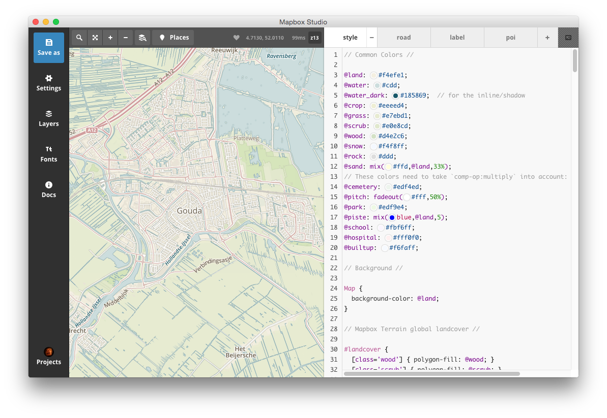

Voor deze tutorial heb je een paar dingen nodig:

- [Mapbox Studio](https://www.mapbox.com/mapbox-studio/), en een [Mapbox-account](https://www.mapbox.com/signup/).
- __Een moderne browser__, zoals Firefox, Safari, Chrome, of een recente versie van Internet Explorer.
- __Een goede texteditor__, bijvoorbeeld [Sublime Text](http://www.sublimetext.com/), [Textmate](http://macromates.com/) of [Notepad++](http://notepad-plus-plus.org/).

De tutorial bestaat uit twee onderdelen:

- __Deel 1__: We downloaden en installeren van Mapbox Studio, we maken een eigen kaartstijl met CartoCSS, en publiceren deze via Mapbox.com.
- __Deel 2__: We downloaden gemeentegrensdata van 't CBS, en we maken een simpele webpagina met HTML en Leaflet.

## Deel 1

#### Download Mapbox Studio

Ga naar https://www.mapbox.com/mapbox-studio/ en download Mapbox Studio. Mapbox Studio is beschikbaar voor Mac OS, Windows en Linux.

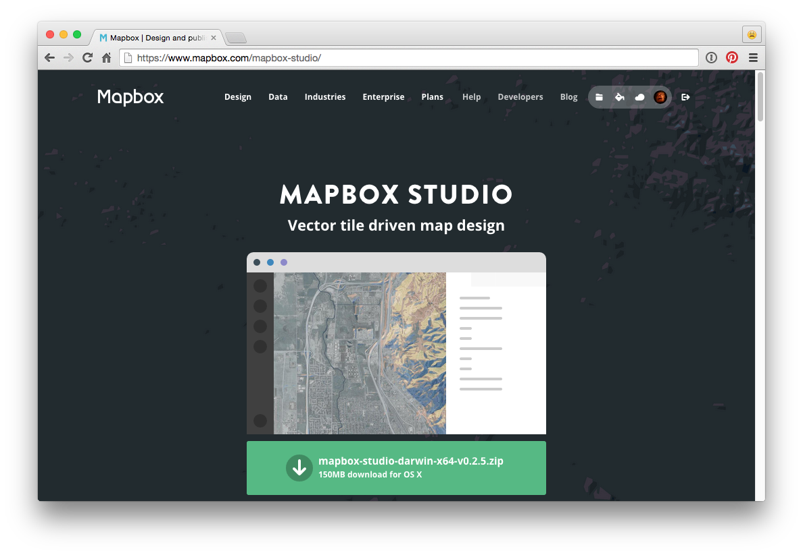

#### Download Mapbox Studio

Om Mapbox Studio te gebruiken heb je een Mapbox-account nodig: https://www.mapbox.com/signup/.

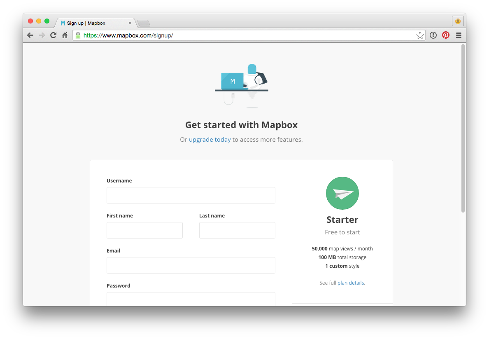

#### Download Mapbox Studio

Start Mapbox Studio, log in, en begin een nieuw project.

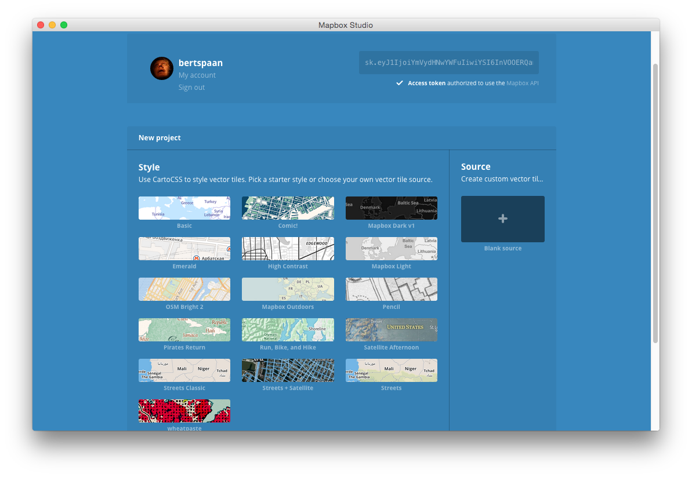

#### Sla je nieuwe project op

Klik op _Save as_, en kies een locatie op je harde schijf.

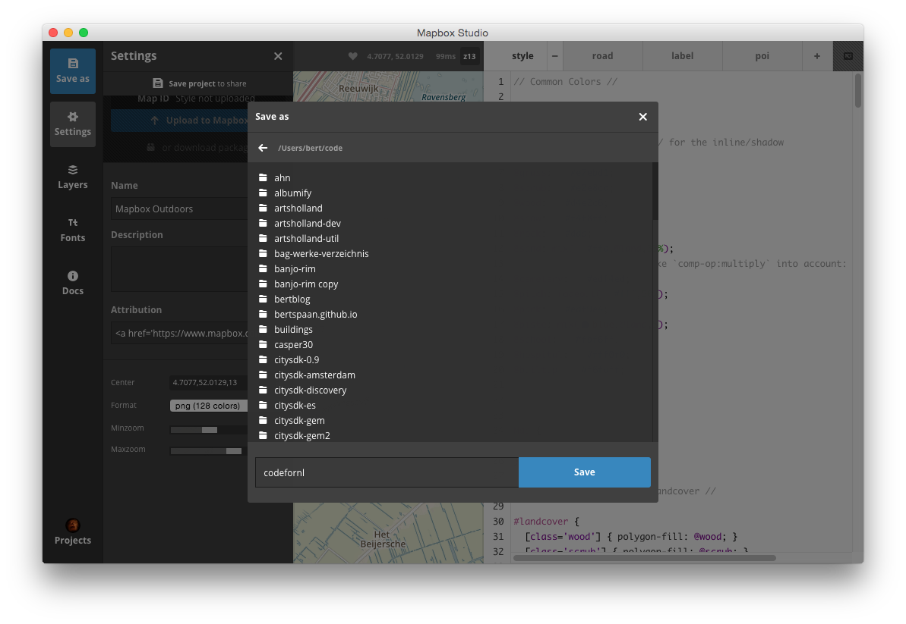

#### Maak een eigen kaartstijl!

Nu begint het echte werk! Met Mapbox Studio kun je je kaart vormgeven met behulp van [CartoCSS](https://www.mapbox.com/guides/intro-to-studio/#what-is-cartocss), een op CSS-gebaseerde stijltaal. Je kunt CartoCSS het beste leren door het gewoon te proberen: kijk naar de met Mapbox Studio meegeleverde voorbeeldkaartstijlen (via [github.com/mapbox](https://github.com/search?utf8=%E2%9C%93&q=user%3Amapbox+language%3Acartocss&type=Repositories&ref=searchresults) kun je er nog meer vinden) en __pas waardes aan en kijk wat er gebeurt__.

Ook staan er veel goede tutorials online, bijvoorbeeld:

- https://www.mapbox.com/guides/intro-to-studio/
- https://speakerdeck.com/almccon/advanced-cartocss-tricks-foss4g-2014


###### Simpele CartoCSS-voorbeelden

Geef de kaart een blauwe achtergrondkleur:

```cartocss
Map {
  background-color: #0000ff;
}
```

Teken snelwegen met een donkergrijze lijn:

```cartocss
#road {
  [class='motorway'] {
    line-color: #444;
    line-cap: round;
    line-width: 0.6;
  }
}
```

###### Documentatie

In Mapbox Studio kun je via de knop _Docs_ documentatie over CartoCSS bekijken.

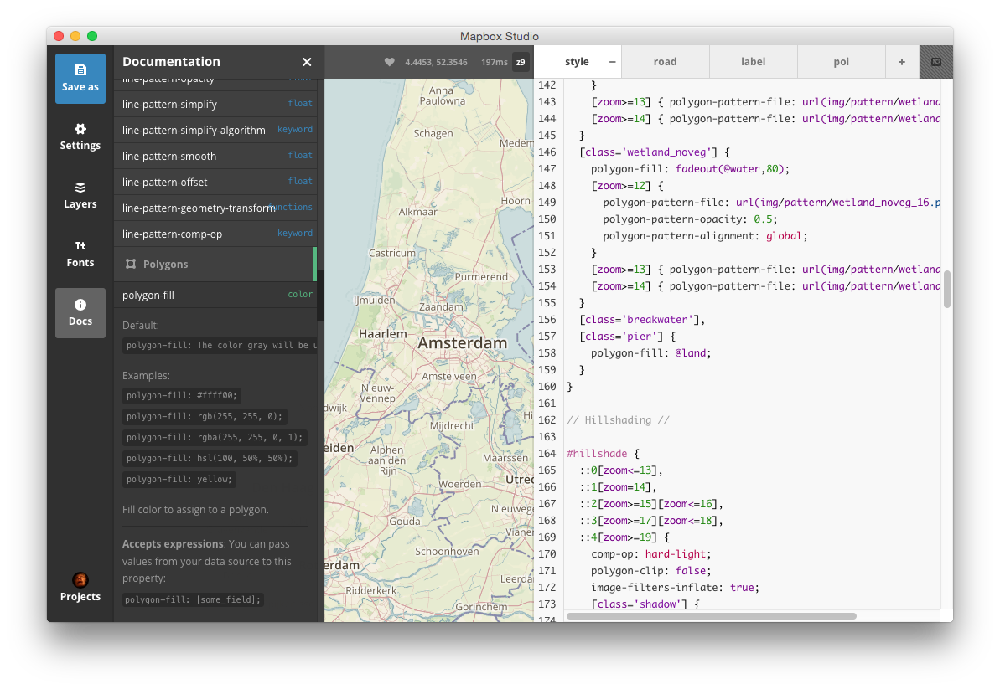

###### Layers

Via de knop _Layers_ krijg je informatie over de beschikbaren datalagen.

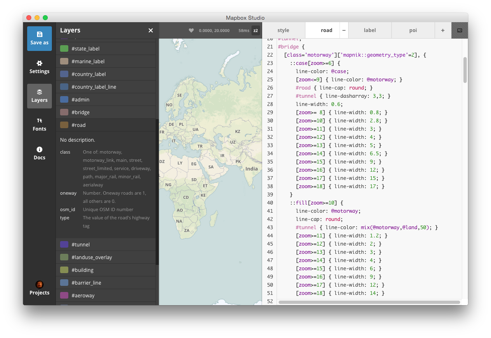

#### Kies een titel, zoomniveau en startpositie

Via _Settings_ kun je de instellingen van je kaart aanpassen. Dit is niet nodig, maar het is handig als je je kaart een eigen startpositie geeft (klik op het slotje en beweeg de kaart op de huidige positie van de kaart over te nemen). Mapbox Studio centreert de kaart op deze positie als je je kaart later opnieuw opent.

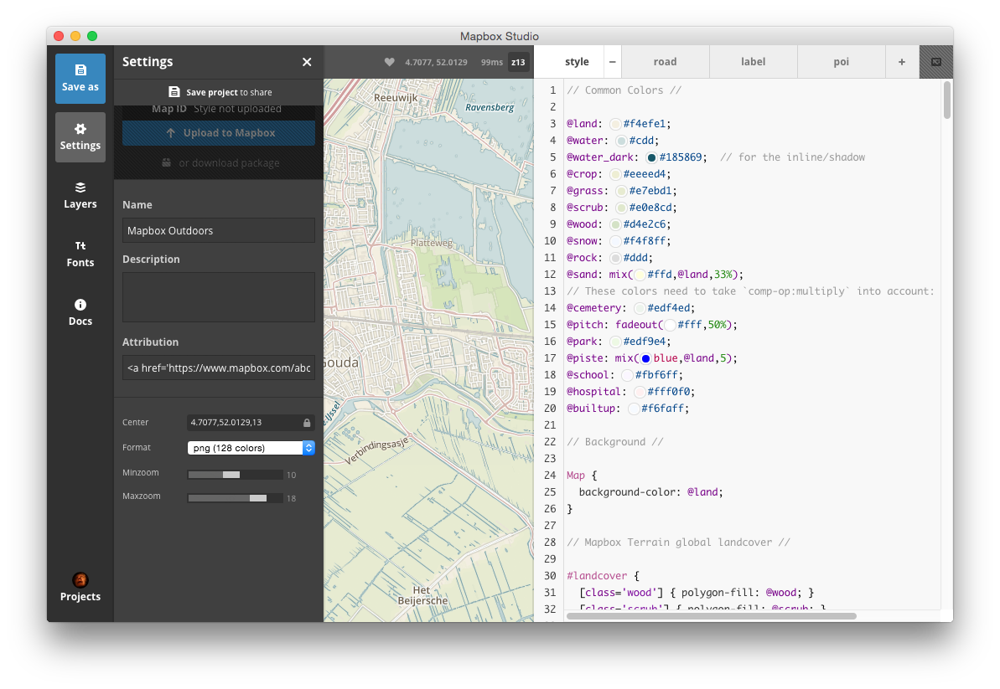

#### Upload je kaart naar Mapbox.com

Met een gratis Mapbox-account kun je één eigen kaartstijl via Mapbox.com publiceren. Dit is nodig als je je kaart via een webpagina wilt ontsluiten (dat doen we in deel 2 van deze tutorial). Sla de kaart op, daarna kun je met de knop _Upload to Mapbox_ uploaden naar Mapbox.com. Je kaart krijgt dan een eigen _Map ID_, deze heb je later nodig. Via https://www.mapbox.com/styles/ krijg je een overzicht van je eigen gepubliceerde kaartstijlen.

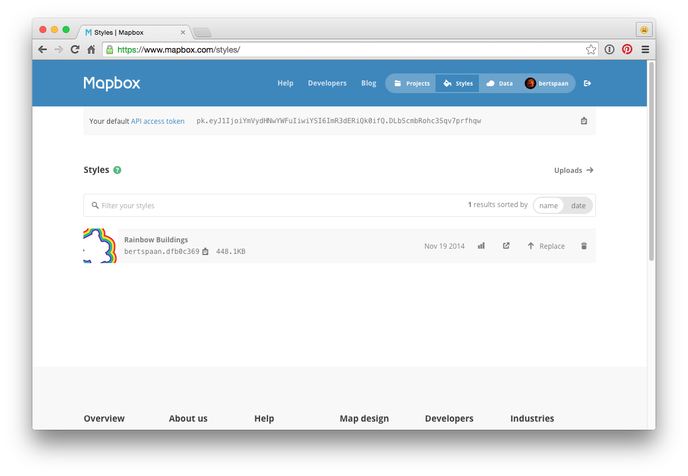

## Deel 2

#### Download gemeentegrenzen van cbs.nl

(_Als je geen QGIS geinstalleerd hebt of wilt installeren, kun de volgende stappen overslaan en naar de stap [Maak een simpele webpagina met Leaflet](#maak-een-simpele-webpagina-met-leaflet) gaan._)

Via de website van 't CBS is een [Shapefile](http://en.wikipedia.org/wiki/Shapefile) te downloaden met de gemeente-, wijk- en buurtgrenzen uit 2013:

 - [Gemeentegrenzen van cbs.nl](http://www.cbs.nl/nl-NL/menu/themas/dossiers/nederland-regionaal/publicaties/geografische-data/archief/2014/2013-wijk-en-buurtkaart-art.htm)

Als je dit ZIP-bestand download en uitpakt, ziet 't er ongeveer zo uit:

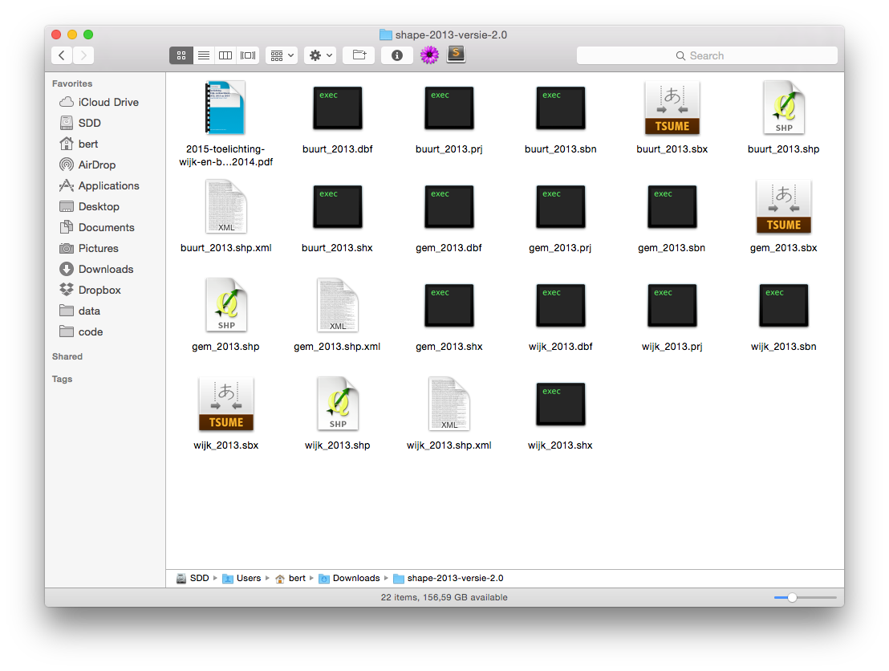

#### Bekijk de data in QGIS

Download en intalleer [QGIS](http://www2.qgis.org/en/site/), een open source GIS-programma, en open hiermee `gem_2013.shp`.

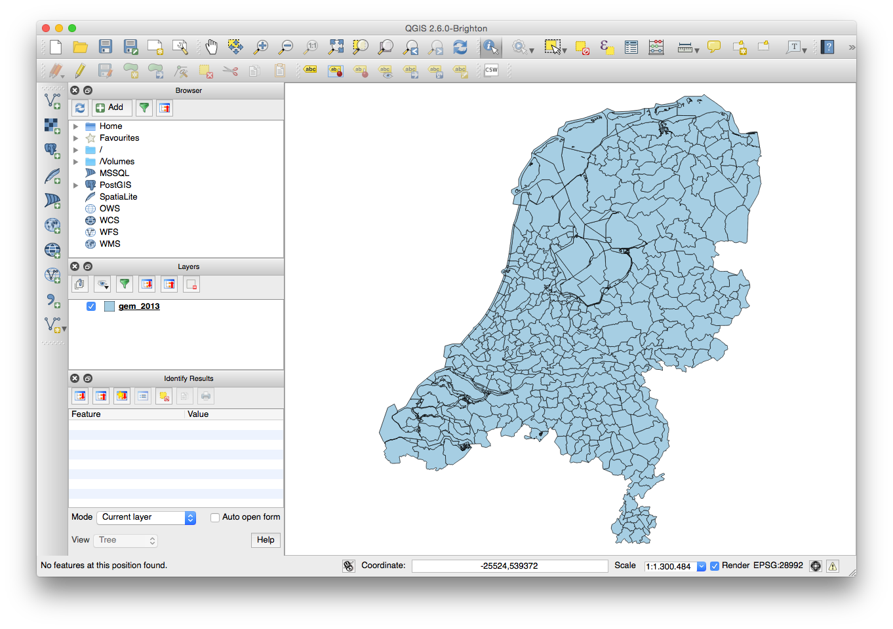

#### Selecteer je eigen gemeente, en exporteer als GeoJSON

De data van het CBS is in 't [Nederlandse coördinatensysteem](http://nl.wikipedia.org/wiki/Rijksdriehoeksco%C3%B6rdinaten). Dit is niet handig voor webcartografie. Bij 't exporteren van onze gemeente, kan QGIS de data omzetten naar een andere projectie. Voor webkaarten wordt meestal [WGS 84](http://en.wikipedia.org/wiki/World_Geodetic_System) (ofwel EPSG:4326) gebruikt.

Selecteer één gemeente met de selectietool van QGIS (het gele vierkantje met wil pijltje), en kies _Layer > Save As..._. Kies GeoJSON als formaat, met _Browse_ een plek voor het bestand op je harde schijf, WGS 84 bij _CRS_. En vink _Save only selected features_ aan!

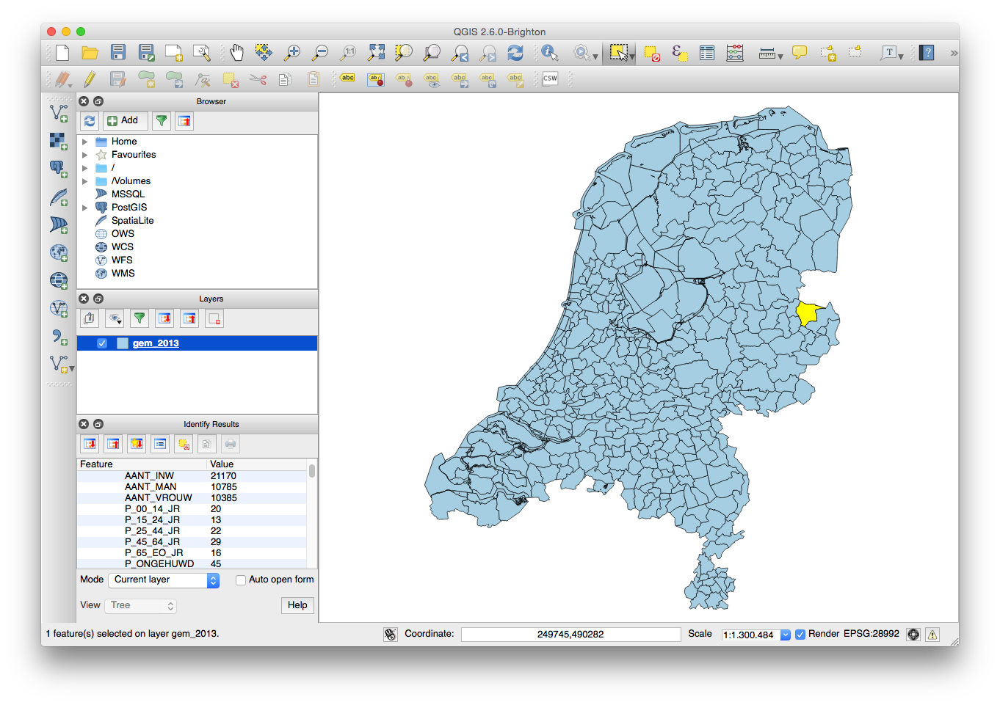
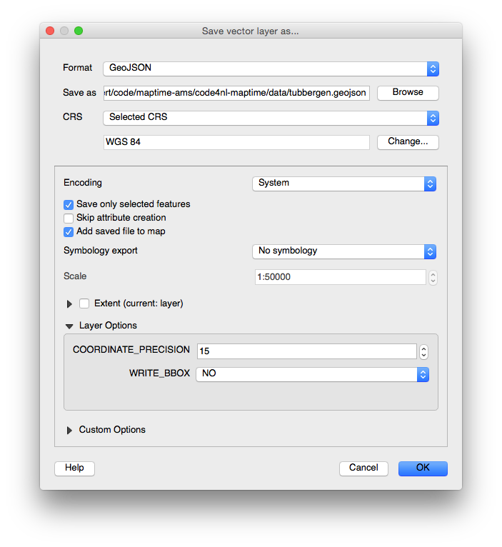

#### Maak een simpele webpagina met Leaflet

Nu is het tijd om een webpagina te maken die met behulp [Leaflet](http://leafletjs.com/) onze kaartstijl laat zien, en het GeoJSON-bestand met gemeentegrens tekent.

Dit kan op twee manieren:

1. Maak nieuwe directory op je harde schijf, maak in deze directory een bestand genaamd `index.html`, en kopieer de inhoud van [`index.html`](index.html) uit deze GitHub-repository in dit nieuwe bestand,
2. Of [download deze GitHub-repository](https://github.com/maptime-ams/codefornl-maptime/archive/gh-pages.zip) in zijn geheel (als ZIP-bestand) of gebruik Git en voer `git clone https://github.com/maptime-ams/animated-borders-d3js.git` uit.

Als je met QGIS een eigen GeoJSON-bestand gemaakt hebt dien je dit bestand te verplaatsen of te kopiëren naar onze nieuwe directory, anders kun je een van de bestaande GeoJSON-bestanden met gemeentegrenzen uit de directory [`gemeente`](gemeente) gebruiken.

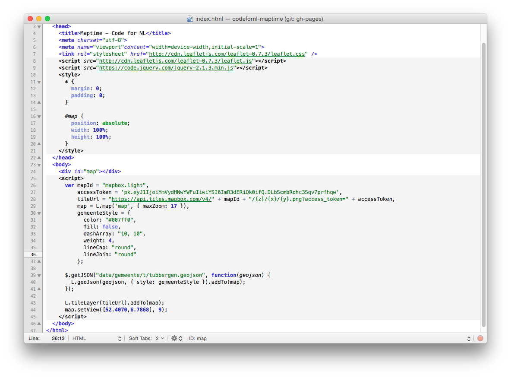

#### Start een eigen webserver!

We kunnen `index.html` in de browser bekijken door te dubbelklikken op het bestand. Echter, omdat we later het GeoJSON-bestand via JavaScript in onze webpagina willen laden is dit niet genoeg. Browsers staan het standaard niet toe dat pagina's data uit externe bronnen laden. Door een eigen webserver te starten overkom je dit probleem.

__Kortom: we hebben een eigen webserver nodig!__ Op een Mac of met Linux kun je eenvoudig de terminal starten, naar de directory gaan waar `index.html` staat, en het volgende commando typen:

    python -m SimpleHTTPServer

Klaar! De webpagina is nu beschikbaar via [http://localhost:8000/](http://localhost:8000/)!

Windows-gebruikers kunnen bijvoorbeeld [Fenix](http://fenixwebserver.com/) gebruiken.

#### Voeg gemeentegrens toe, en je eigenkaartstijl

Pas `index.html` aan en voeg je vervang de bestaande _Map ID_ en [_API access token_](https://www.mapbox.com/account/apps/) voor die van jezelf. En vervang de locatie van het huidige GeoJSON-bestand (`data/gemeente/t/tubbergen.geojson`) voor de naam van het bestand dat je met QGIS hebt geëxporteerd.

Uiteindelijk ziet de webpagina er ongeveer zo uit, maar dan met je eigen gemeente en kaartstijl:

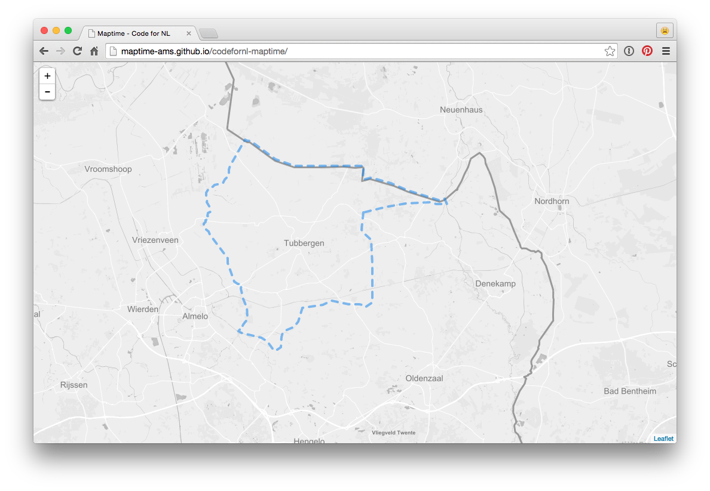
